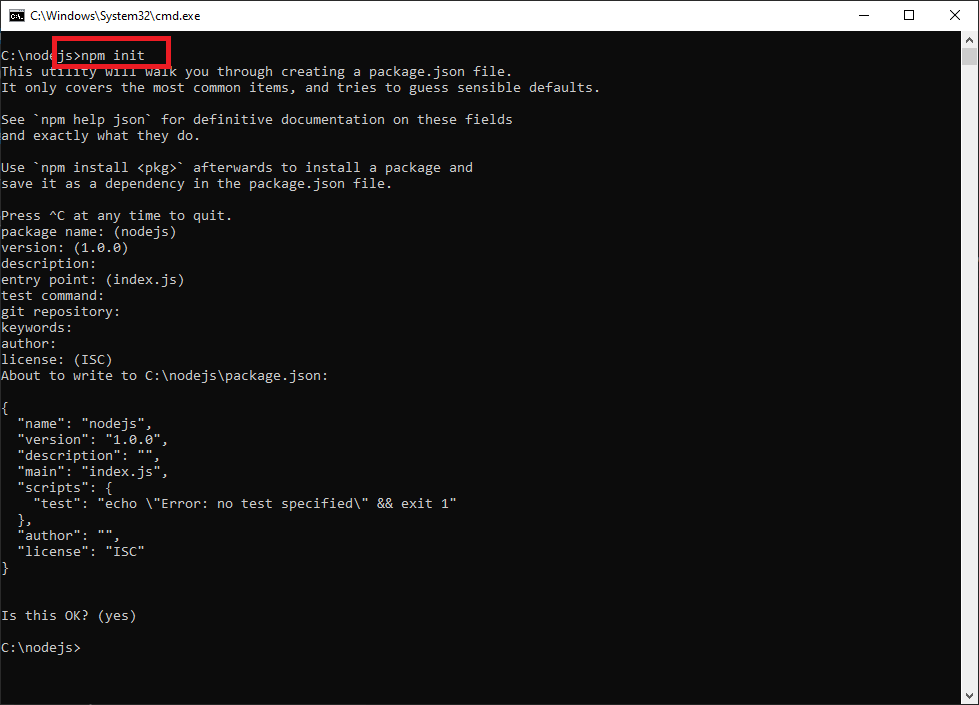
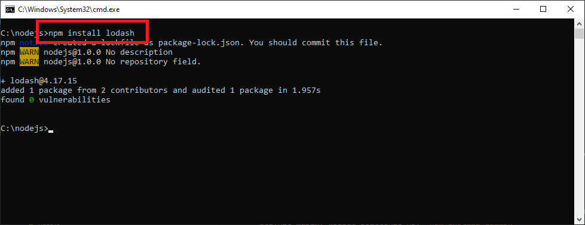
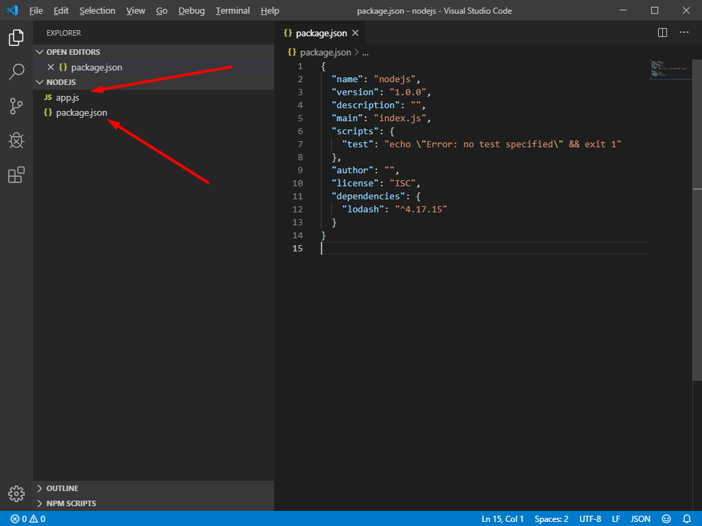

# Node.js - Laboratorium 2

## Wykład

https://slides.com/piotrtarasiuk/nodejs-basic
https://slides.com/piotrtarasiuk/nodejs-event-loop


## `npm`

Aby rozpocząć przygodę z menadżerem pakietów do każdego projektu musimy stworzyć plik `package.json` poprzez wywołanie komendy: `npm init`



W tak przygotowanym katalogu możemy już instalować zewnętrze pakiety, aby to uczynić musimy wpisać polecenie np: `npm install lodash`



W tym momencie NPM pobierze dany pakiet i umieści go w naszym katalogu `node_modules` oraz dopisze do pliku `package.json` informację o zainstalowanym pakiecie:


Aby wykorzystać zewnętrzny pakiet w naszej aplikacji musimy go po prostu wczytać:
```
const _ = require('lodash');

console.log(_.max([3, 6, 200, -5]));

```

## UWAGA!!!!

Jeżeli mamy już plik `package.json` pobrany z jakiegoś repozytorium nie tworzymy nowego pliku a jedynie instalujemy niezbędne pakiety, które znajdują się w pliku `package.json`:

### Przykład:

W takim przypadku jeżeli mamy plik `package.json` ale nie mamy pobranych zewnętrznych modułów powinniśmy uruchomić ich instalację poleceniem: `npm install`




## Przydatne linki

`npm`: https://www.npmjs.com/


## Zadania do wykonania na laboratorium

1. Zadaniem jest stworzenie aplikacji składającej się z 2 plików `app.js` oraz plików z `utils.js` w którym to zostanie zaimplementowana funkcja usuwania zduplikowanych elementów w tablicy.

Przykładowowe wywołanie w `app.js`:
```
const utils = ...

const someArray = ['ala', 3, 'ma', 'kota', 2, 'ala', 5, 3];

const funcResult = utils.uniq(someArray);

console.log(funcResult);

```

2. Dodajmy nową funkcjonalność do naszej aplikacji z zadania 1. Stwórzmy funkcję która zwróci różnicę między 2 tablicami.

Przykładowe dane wejściowe:
```
const utils = ...

const tabA = ['ala', 'ma', 'kota'];
const tabB = ['ala', 'ma', 'psa'];

console.log(utils.diff(tabA, tabB));
console.log(utils.diff(tabB, tabA));

```


3. Zmodyfikujmy 2 zadanie tak aby funkcja odpowiedzialna za usuwanie zduplikowanych wartości pochodziła nie z modułu lokalnego a z repozytorium `npm` (nazwa modułu `lodash`). Podmieńmy również funkcję do porównywania tablic na funkcję z modułu `lodash`.

4. Wykorzystując bibliotekę `lodash` znaleźć minimalną oraz maksymalną wartość w tablicy:

```
[3, 5, -20, -1002, 234, 542, 6, 23, -3, 8]
```

5. Zainstalować globalny moduł 'nodemon'(https://www.npmjs.com/package/nodemon), aby możliwe było automatyczne restartowanie w przypadku wykrycia zmian napisanych przez nas aplikacji.

6. Wykorzystując zdobytą wiedzę z poprzednich zajęć skorzystaj z zewnętrznej biblioteki `yargs` (moduł odpowiedzialny parsowanie parametrów wejściowych). Stwórz prosty kalkulator wprowadzonych danych.

```
> node app.js --a=5 --b=7 --operator=*
```

Konsola powinna zwrócić wynik operacji

```
wynik: 35
```

7. Zmodyfikujmy naszą aplikację z zadania 6 tak, aby stworzone funkcje wywoływały funkcję `callback` podaną jako 3 parametr. Wynik powinien być przekazany jako parametr wywołania funkcji `callback`, przykład:

```
function add(a, b, callback) {
    const result = ...;

    callback(result);
}

// wywołanie:

add(2, 4, function someCallback(wynik) {
    console.log(wynik);
})

```

8. Dodajmy do naszej aplikacji z zadania 7 zapis do pliku. W tym przypadku użyjmy jednak funkcji asynchronicznej `writeFile`.

9. Stworzyć aplikację, która wyświetli na ekranie przywitanie użytkownika aktualnie zalogowanego na komputerze po 5 sekundach od uruchomienia aplikacji.
Wykorzystaj tutaj wiedzę z poprzednich zajęć (podpowiedź: moduł `os`, funkcja `userInfo()`) oraz funkcję `setTimeout()` która pozwala na wrzucenie naszej funkcji do Node API.

10. Zmodyfikujmy zadanie 9 tak aby zapisać nasze przywitanie do pliku wykorzystując funkcję `writeFile`.

11. Stwórz aplikację która pobierze dane dotyczące pogody i wyświetl ją na konsoli.

W tym zadaniu wykorzystamy zewnętrzny moduł `request`. Pakiet ten udostępnia nam funkcje pozwalające na wysłanie żądania do zewnętrznego serwera i pobranie danych.

Adres do pobrania danych:
```
https://api.openweathermap.org/data/2.5/weather?q=Bia%C5%82ystok&APPID=0ed761300a2725ca778c07831ae64d6e
```

12. Zmodyfikujmy zadanie 11 tak aby miejscowość była podawana przez parametr wejściowy. W tym celu dodajmy zewnętrzny moduł `yargs`.

Przykładowe wywołanie programu:
```
> node app --city=bialystok
```